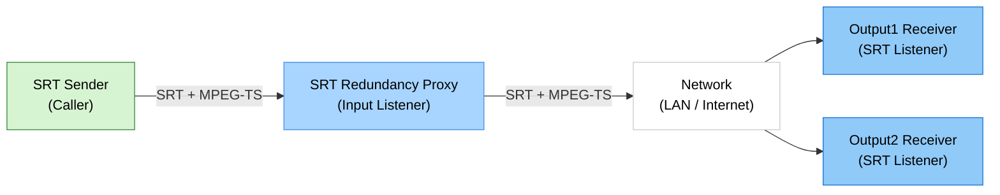

# SRT Redundancy Proxy

> Proxy de redundancia SRT para Windows con una entrada y dos salidas seleccionables

> Languages: [English](index.md)  | [中文](index.zh.md) | [한국어](index.ko.md) | [Español](index.es.md)

[](https://github.com/VideoSupporter/srt-redundancy-proxy)
[](https://www.srtalliance.org/)

[Microsoft Store Single free](https://apps.microsoft.com/detail/9P3185VF5P3S)

[Microsoft Store Multi](https://apps.microsoft.com/detail/9NDN3J7D5Z6T)

SRT Redundancy Proxy recibe un flujo SRT y lo reenvia hasta a dos destinos SRT en Windows.
Esta pensado para flujos de trabajo de contribucion redundante, monitoreo y validacion donde el mismo flujo MPEG-TS debe llegar a varios receptores.

## Key Features

- **Una entrada SRT** - Recibe un flujo SRT en un puerto de entrada configurable.
- **Dos salidas SRT** - Reenvia el flujo de entrada a los destinos Output1 y Output2.
- **Control independiente de salidas** - Activa o desactiva cada salida mientras el proxy esta en ejecucion.
- **Inicio automatico** - Inicia el proxy con la configuracion guardada al abrir la aplicacion.
- **Estadisticas en vivo** - Supervisa estado de conexion, bitrate, RTT, conteos de paquetes y bytes, descartes y errores.
- **Registros locales** - Abre la carpeta de logs de la aplicacion para diagnostico.
- **Edicion gratuita de una instancia** - La edicion gratuita se ejecuta solo como ID=1 e impide abrir una segunda instancia gratuita.

## Network Configuration



## Screenshot


## How to Use

### 1. Start SRT Receivers

Inicia uno o dos listeners SRT en los equipos receptores. Para una prueba rapida, usa FFplay:

```bash
ffplay "srt://0.0.0.0:9100?mode=listener"
ffplay "srt://0.0.0.0:9200?mode=listener"
```

### 2. Configure the Proxy

Abre SRT Redundancy Proxy y configura el puerto de entrada y los destinos de salida.
De forma predeterminada, la aplicacion escucha en el puerto `9000` y reenvia a `127.0.0.1:9100` y `127.0.0.1:9200`.

### 3. Send a Stream to the Input

Envia un flujo SRT al puerto de entrada del proxy desde un codificador, FFmpeg u otro emisor SRT:

```bash
ffmpeg -re -i input.ts -c copy -f mpegts "srt://127.0.0.1:9000?mode=caller"
```

### 4. Monitor the Relay

La aplicacion actualiza el estado de conexion y las estadisticas cada segundo.
Usa los controles Output1 y Output2 para controlar cada ruta de reenvio.

## System Requirements

- Windows 11 x64
- Aplicaciones emisoras y receptoras compatibles con SRT
- Acceso de red entre el emisor, el proxy y los receptores

## Notes

- La version actual usa entrada SRT listener y salidas SRT caller.
- La aplicacion reenvia payloads SRT y no transcodifica ni modifica video o audio.
- El cifrado SRT no esta habilitado de forma predeterminada.
- El usuario es responsable de configurar direcciones, puertos, reglas de firewall y manejo del flujo.
- La edicion gratuita admite una sola instancia en ejecucion. Usa la edicion multi cuando necesites varias instancias simultaneas.

## Support

- [GitHub Issues](https://github.com/VideoSupporter/srt-redundancy-proxy/issues)
- Contact: videosp.info@gmail.com
