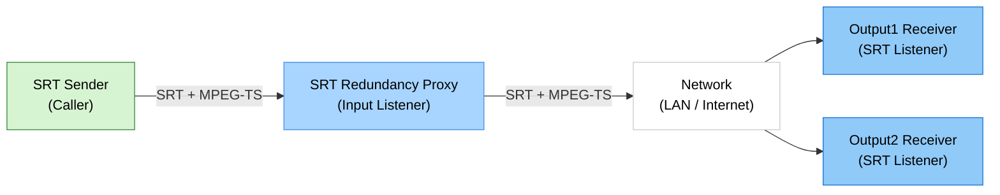

# SRT Redundancy Proxy

> Windows용 1 입력 2 출력 SRT 이중화 프록시

> Languages: [English](index.md) | [中文](index.zh.md) | [한국어](index.ko.md) | [Español](index.es.md)

[](https://github.com/VideoSupporter/srt-redundancy-proxy)
[](https://www.srtalliance.org/)

[Microsoft Store Single free](https://apps.microsoft.com/detail/9P3185VF5P3S)

[Microsoft Store Multi](https://apps.microsoft.com/detail/9NDN3J7D5Z6T)

SRT Redundancy Proxy는 Windows에서 하나의 SRT 스트림을 수신하고 최대 두 개의 SRT 대상으로 전달하는 앱입니다.
동일한 MPEG-TS 스트림을 여러 수신기로 중계해야 하는 이중화 전송, 모니터링, 검증 워크플로에 적합합니다.

## Key Features

- **하나의 SRT 입력** - 설정 가능한 입력 포트에서 SRT 스트림을 수신합니다.
- **두 개의 SRT 출력** - 입력 스트림을 Output1 및 Output2 대상으로 전달합니다.
- **독립 출력 제어** - 프록시 실행 중 각 출력을 개별적으로 활성화하거나 비활성화할 수 있습니다.
- **자동 시작** - 앱 실행 시 저장된 설정으로 프록시를 시작합니다.
- **실시간 통계** - 입력/출력 연결 상태, 비트레이트, RTT, 패킷 수, 바이트 수, 드롭, 오류를 확인합니다.
- **로컬 로그** - 문제 해결을 위해 애플리케이션 로그 폴더를 열 수 있습니다.
- **무료 버전 단일 인스턴스** - 무료 버전은 ID=1로만 실행되며 두 번째 무료 버전 인스턴스 시작을 차단합니다.

## Network Configuration



## Screenshot


## How to Use

### 1. Start SRT Receivers

수신 장비에서 하나 또는 두 개의 SRT listener를 시작합니다. 간단한 테스트에는 FFplay를 사용할 수 있습니다.

```bash
ffplay "srt://0.0.0.0:9100?mode=listener"
ffplay "srt://0.0.0.0:9200?mode=listener"
```

### 2. Configure the Proxy

SRT Redundancy Proxy를 실행하고 입력 포트와 출력 대상을 설정합니다.
기본값은 입력 포트 `9000`에서 수신하고 `127.0.0.1:9100` 및 `127.0.0.1:9200`으로 전달합니다.

### 3. Send a Stream to the Input

인코더, FFmpeg 또는 다른 SRT 송신기에서 프록시 입력 포트로 SRT 스트림을 보냅니다.

```bash
ffmpeg -re -i input.ts -c copy -f mpegts "srt://127.0.0.1:9000?mode=caller"
```

### 4. Monitor the Relay

앱은 연결 상태와 통계를 1초마다 업데이트합니다.
Output1 및 Output2 토글로 각 전달 경로를 제어할 수 있습니다.

## System Requirements

- Windows 11 x64
- SRT 호환 송신 및 수신 애플리케이션
- 송신기, 프록시, 수신기 간 통신 가능한 네트워크 환경

## Notes

- 현재 릴리스는 SRT listener 입력과 SRT caller 출력을 사용합니다.
- 앱은 SRT payload를 중계하며 비디오/오디오를 트랜스코딩하거나 변경하지 않습니다.
- SRT 암호화는 기본적으로 활성화되어 있지 않습니다.
- 수신 주소, 포트, 방화벽 규칙, 스트림 처리 방식은 사용자가 관리해야 합니다.
- 무료 버전은 하나의 실행 인스턴스만 지원합니다. 여러 인스턴스가 필요하면 multi 버전을 사용하세요.

## Support

- [GitHub Issues](https://github.com/VideoSupporter/srt-redundancy-proxy/issues)
- Contact: videosp.info@gmail.com
