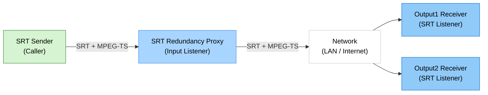
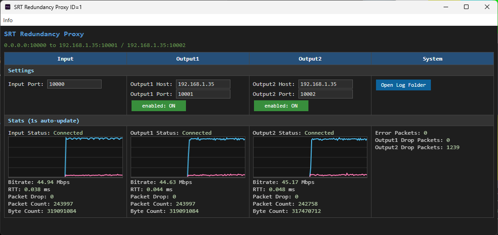

# SRT Redundancy Proxy

> Windows SRT stream redundancy proxy with one input and two selectable outputs

> Languages: [English](index.md) | [中文](index.zh.md) | [한국어](index.ko.md) | [Español](index.es.md)

[](https://github.com/VideoSupporter/srt-redundancy-proxy)
[](https://www.srtalliance.org/)

[Microsoft Store Single free](https://apps.microsoft.com/detail/9P3185VF5P3S)

[Microsoft Store Multi](https://apps.microsoft.com/detail/9NDN3J7D5Z6T)


SRT Redundancy Proxy receives one SRT stream and forwards it to up to two SRT destinations on Windows.
It is designed for redundant contribution and monitoring workflows where the same MPEG-TS stream should be relayed to multiple receivers.

## Key Features

- **One SRT Input** - Receive an SRT stream on a configurable input port.
- **Two SRT Outputs** - Forward the input stream to Output1 and Output2 destinations.
- **Independent Output Control** - Enable or disable each output while the proxy is running.
- **Automatic Startup** - Start the proxy with the saved settings when the app launches.
- **Live Statistics** - Monitor input/output connection status, bitrate, RTT, packet counts, byte counts, drops, and errors.
- **Local Logs** - Open the application log folder for troubleshooting.
- **Single-Instance Free Edition** - The free edition runs as ID=1 and prevents a second free instance from starting.

## Network Configuration



## Screenshot



## How to Use

### 1. Start SRT Receivers

Start one or two SRT listeners on the receiving machines. For a quick test, use FFplay:

```bash
ffplay "srt://0.0.0.0:9100?mode=listener"
ffplay "srt://0.0.0.0:9200?mode=listener"
```

### 2. Configure the Proxy

Launch SRT Redundancy Proxy and set the input port and output destinations.
By default, the app listens on input port `9000` and forwards to `127.0.0.1:9100` and `127.0.0.1:9200`.

### 3. Send a Stream to the Input

Send an SRT stream to the proxy input port from an encoder, FFmpeg, or another SRT sender:

```bash
ffmpeg -re -i input.ts -c copy -f mpegts "srt://127.0.0.1:9000?mode=caller"
```

### 4. Monitor the Relay

The app updates connection status and statistics every second.
Use the Output1 and Output2 toggles to control each forwarding path.

## System Requirements

- Windows 11 x64
- SRT-compatible sender and receiver applications
- Network access between the sender, proxy, and receivers

## Notes

- The current release uses an SRT listener input and SRT caller outputs.
- The app relays SRT payloads and does not transcode or modify video/audio content.
- SRT encryption is not enabled by default.
- Users are responsible for configuring receiver addresses, ports, firewall rules, and stream handling.
- The free edition supports one running instance. Use the multi edition when multiple simultaneous instances are required.

## Support

- [GitHub Issues](https://github.com/VideoSupporter/srt-redundancy-proxy/issues)
- Contact: videosp.info@gmail.com
