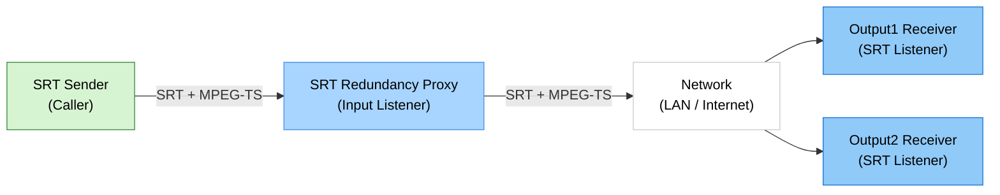

# SRT Redundancy Proxy

> Windows SRT 冗余代理，支持一路输入和两路可选输出

> Languages: [English](index.md) | [中文](index.zh.md) | [한국어](index.ko.md) | [Español](index.es.md)

[](https://github.com/VideoSupporter/srt-redundancy-proxy)
[](https://www.srtalliance.org/)

[Microsoft Store Single free](https://apps.microsoft.com/detail/9P3185VF5P3S)

[Microsoft Store Multi](https://apps.microsoft.com/detail/9NDN3J7D5Z6T)

SRT Redundancy Proxy 在 Windows 上接收一路 SRT 流，并将其转发到最多两个 SRT 目标。
它适用于需要将同一 MPEG-TS 流中继到多个接收端的冗余传输、监看和验证场景。

## Key Features

- **一路 SRT 输入** - 在可配置的输入端口接收 SRT 流。
- **两路 SRT 输出** - 将输入流转发到 Output1 和 Output2。
- **独立输出控制** - 在代理运行时分别启用或禁用每一路输出。
- **自动启动** - 应用启动时使用保存的设置启动代理。
- **实时统计** - 查看输入/输出连接状态、码率、RTT、包数、字节数、丢包和错误。
- **本地日志** - 打开应用日志文件夹以便排查问题。
- **免费版单实例** - 免费版仅以 ID=1 运行，并阻止启动第二个免费版实例。

## Network Configuration



## Screenshot


## How to Use

### 1. Start SRT Receivers

在接收机器上启动一个或两个 SRT listener。快速测试可以使用 FFplay：

```bash
ffplay "srt://0.0.0.0:9100?mode=listener"
ffplay "srt://0.0.0.0:9200?mode=listener"
```

### 2. Configure the Proxy

启动 SRT Redundancy Proxy，并设置输入端口和输出目标。
默认情况下，应用监听输入端口 `9000`，并转发到 `127.0.0.1:9100` 和 `127.0.0.1:9200`。

### 3. Send a Stream to the Input

从编码器、FFmpeg 或其他 SRT 发送端向代理输入端口发送 SRT 流：

```bash
ffmpeg -re -i input.ts -c copy -f mpegts "srt://127.0.0.1:9000?mode=caller"
```

### 4. Monitor the Relay

应用每秒更新连接状态和统计信息。
使用 Output1 和 Output2 开关控制每一路转发路径。

## System Requirements

- Windows 11 x64
- 支持 SRT 的发送端和接收端应用
- 发送端、代理和接收端之间可通信的网络环境

## Notes

- 当前版本使用 SRT listener 输入和 SRT caller 输出。
- 应用只中继 SRT payload，不转码或修改视频/音频内容。
- 默认不启用 SRT 加密。
- 用户负责配置接收地址、端口、防火墙规则和流处理方式。
- 免费版仅支持一个运行中的实例。如需同时运行多个实例，请使用 multi 版本。

## Support

- [GitHub Issues](https://github.com/VideoSupporter/srt-redundancy-proxy/issues)
- Contact: videosp.info@gmail.com
